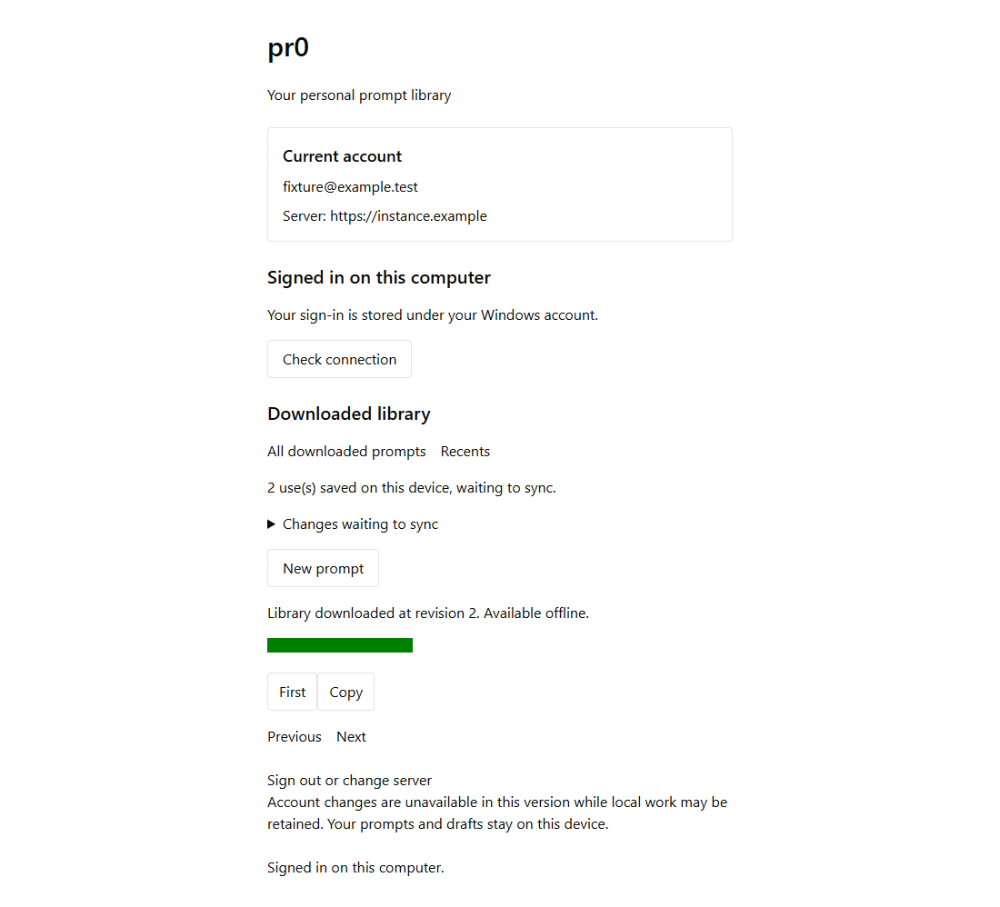

# Issue #49 — offline clipboard and Recents

Validated on Windows on 2026-09-21 with Bun 1.4.2, the native Rust/Tauri service, real SQLite, the Windows clipboard, Windows Credential Manager, PostgreSQL containers and installed Microsoft Edge in headless mode.

## Behavior and boundaries

- `library_copy` receives only prompt identity and the originating instance/account/generation. Rust reads current local content, rejects overlapping writes (including draft recovery), and holds the partition stable during the OS call. IPC admission occurs before blocking-worker scheduling. No SQLite transaction spans clipboard access.
- After clipboard success, a UUID event commits in SQLite. Local recency is a projection of that same event, so recency and pending delivery cannot diverge. Failure retains copy success and an in-memory usage-only retry. That retry has no restart guarantee; pending durable or in-memory uses prevent account cleanup.
- A separate native delivery queue freezes the existing public `prompt.use` envelope. Receipt lookup after restart reuses it. Accepted occurrence time replaces provisional time; snapshot acknowledgement retires only included events. Prompt modification time and content remain unchanged.
- Recents uses all active downloaded prompts, 50 per page, ordered by latest use, shared normalized title and identity. It excludes archived/unused prompts. Usage never creates a prompt or retargets it to a conflict copy.
- List and detail buttons share the native command and accessible status. UI completion carries its originating generation; reauthentication preserves existing editor drafts. There is no new REST endpoint or OpenAPI shape: existing mutation/receipt contracts remain authoritative; typed native schemas and Tauri permissions are added together.

## Executed checks

- Native command tests: copy rejection, exact OS clipboard text including Unicode/whitespace, concurrent-window rejection and controlled delay, obsolete generation, SQLite write refusal with usage-only retry, restart, frozen UUID replay, future correction, downloaded server usage and 53-prompt pagination without duplicate rows.
- `bun --env-file=apps/web/tests/device.env apps/web/tests/usage-runner.ts` with `PR0_TEST_BROWSER=msedge`: public REST conformance (3 tests), real native HTTPS approval/credential/process-restart journey, actual clipboard write, deliberately lost server response, receipt replay, delayed old usage, future correction, matching web/local counts and dates, incoming web-only usage without a local copy, archive/restore, and deletion before queued usage arrives. Passed.
- `bun test apps/web/tests/usage-ui.test.ts` with `PR0_TEST_BROWSER=msedge` and `PR0_DESKTOP_TEST_URL=http://127.0.0.1:14249`: production desktop React UI bridged to the real typed native service. Clipboard rejection retains the prompt, usage I/O failure reports successful copy separately, usage retry does not write the clipboard again, keyboard Copy updates one Recents row, reload retains it, and delayed completion cannot update a new UI generation. Passed, 8 assertions, including repeated selection of the active view and editor-draft preservation during reauthentication.
- Root `bun run test`: all workspace test tasks passed. Native full suite: all 45 tests passed together with Windows credential access enabled. An earlier sandbox run denied the existing credential subprocess test access; that environment limitation was resolved by running with the required OS access.

The initial UI attempt reached another development server on port 1420; the passing run uses this worktree explicitly on port 14249. Chrome was absent; Edge was explicitly selected. Neither attempt is counted as a product failure or a successful validation.

These are native-service/OS and browser interaction checks, not an installer certification, a clean-machine release check, or a performance-capacity claim. The UI bridge substitutes IPC transport/events only; storage and clipboard operations execute in Rust.

## Review and additional verification

### Standards

Zero documented-standard violations. One nonblocking suggestion remains: the receipt-or-mutation exchange in edit and usage delivery could share a helper in a future refactor. Both paths currently retain their own preparation, acknowledgement and generation checks.

### Spec

Three findings were corrected: incoming web-only usage now refreshes through a bounded 30-second snapshot check (unchanged revision/epoch skips page downloads, transient transport errors back off); clicking the active view preserves rows; usage-only authentication failure exposes the same-account sign-in path. The additional UI state correction preserves editor drafts across reauthentication while suppressing an older copy completion.

Workspace typecheck, Ultracite and native cargo check/format checks passed. The desktop production UI build passed with the HTTPS placeholder `VITE_API_BASE_URL=https://instance.example`; no service was contacted and no deployment was performed.

## Reproduction

1. Install the locked dependencies with `bun install --frozen-lockfile`. Set the normal Rust/MSVC toolchain paths.
2. Run `cargo test --manifest-path apps/desktop/src-tauri/Cargo.toml --lib --locked` with access to Windows Credential Manager.
3. Set `PR0_TEST_BROWSER=msedge` (or use the default installed Chrome), then run `bun run --cwd apps/web test:desktop-copy`. Docker must be available; the runner creates and removes its own disposable containers.
4. Start this worktree's UI with `bun --bun apps/desktop/node_modules/vite/bin/vite.js apps/desktop --host 127.0.0.1 --port 14249 --strictPort`, set `PR0_DESKTOP_TEST_URL=http://127.0.0.1:14249`, and run `bun test apps/web/tests/usage-ui.test.ts`.
