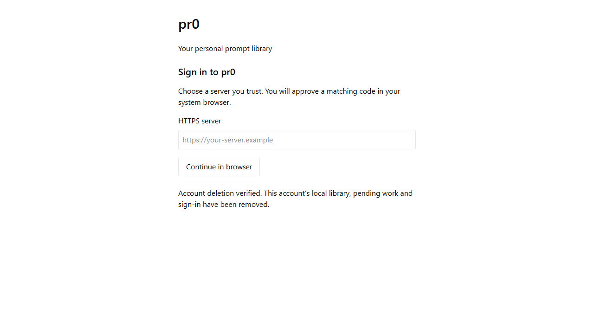

# Issue 57 — returning desktop deletion proof

Validated on Windows on 2026-09-21 with Bun 1.4.2, the Rust/Tauri native command service, PostgreSQL 17 and installed Microsoft Edge driven by Playwright.

## Observed behavior

- Public native commands over real SQLite accept the exact Ed25519 JWS signing input and fixed receipt type. Shared Bun/Rust vectors cover old irreversible receipts, signed key rotation, incorrect algorithm/type/signature/account/instance/handle, unknown signing keys, duplicate rotation and an untrusted anchor.
- A desktop reopened without its credential verifies rotated evidence using its persisted anchor, removes only its account partition, and preserves an unrelated account file. Replaying the same valid receipt remains authoritative.
- A 7,000-rotation native regression exceeds 4 MiB of retained continuity. The client verifies bounded pages incrementally with no total chain-size lifetime cap. The real endpoint journey validates the paged response, legacy response and invalid-page rejection.
- Pending intent, unsigned absence, network/authorization failure and replacement identities preserve retained work. Upload checks require both deletion lookup and current account authority.
- Credential deletion and filesystem cleanup failures leave a durable, blocking cleanup state. Retry works after process restart without a network connection. Old save/copy commands and a delayed authority response cannot restore access or write the clipboard.
- The end-to-end runner signs in through browser approval and Windows Credential Manager, restarts the native process, creates pending local work and an unsaved desktop draft, rotates the actual server key twice, and deletes the account through the public freshly authenticated REST endpoint. The desktop UI's Check connection command invokes the real Rust HTTPS receipt endpoint and clears the partition and draft. The recorded mutation/receipt upload traffic is empty. The native library lookup then fails and all account library files are absent.

## Checks and reproduction

- `bun run typecheck` and `bun run test` passed.
- All 73 native tests passed with Windows Credential Manager access. The initial restricted-sandbox run could not access that vault; no production fallback was introduced.
- Changed-file Ultracite checks and Git whitespace validation passed.
- The real endpoint/UI journey passed with `PR0_TEST_BROWSER=msedge` using `bun --env-file=apps/web/tests/account-deletion.env apps/web/tests/returning-deletion-runner.ts`. It creates and removes the disposable `pr0-returning-57` Compose project. Rust tooling must be on PATH.
- Run native regressions with `cargo test --manifest-path apps/desktop/src-tauri/Cargo.toml --lib --locked`. The shared vectors can be reproduced with `bun apps/web/tests/deletion-proof-vectors.ts`.

The UI check serves the production desktop React components with a command bridge to the actual Rust service, HTTPS transport and Windows credentials. It does not claim a packaged installer/WebView or reboot validation. No new native command or permission is exposed; existing authenticated renderer command restrictions remain in effect. The verification REST endpoint, shared schema and OpenAPI add optional bounded pages while preserving the legacy full-chain response.

## Integration with download recovery

After merging `main` at `c4ff1ee` into PR #79, the native journey helper preserves both the download-recovery mode and the returning-deletion callback. The deletion runner supplies the recovery argument explicitly, and a duplicate sign-out arm in the merged native test worker was removed.

- All 80 native tests, workspace tests and type checks passed. Changed-file Ultracite, Rust formatting and Git whitespace checks passed.
- The returning-deletion HTTPS/UI journey passed again, including exact cleanup, draft invalidation and zero uploads.
- The download-recovery HTTPS/UI journey also passed, including expired-snapshot recovery across restart, 91-day offline history, three retained prompts, accepted work awaiting download and intervening changes. This run used disposable Compose project `pr0-merge-79` and separate ports because the default test port was occupied; its temporary runner/configuration files and containers were removed afterward.

## Standards review

No remaining actionable findings. The initial review passed; review of pagination requested shared named page-size constants, which were added.

## Specification review

No remaining actionable findings after correction. The reviewer identified that a single capped response would impose a finite key-rotation lifetime. Bounded continuity pages and the 7,000-rotation regression resolved it; follow-up review cleared the correction.
