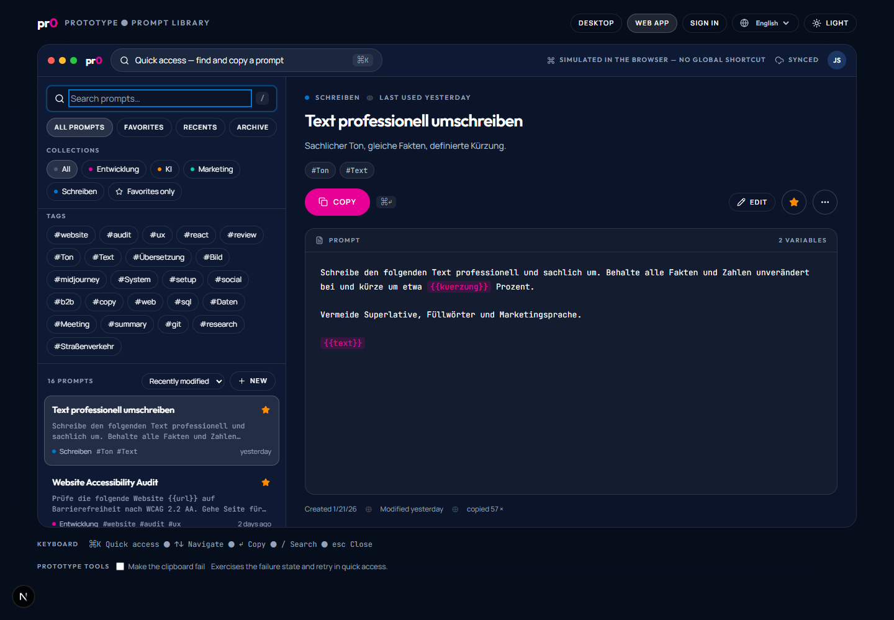
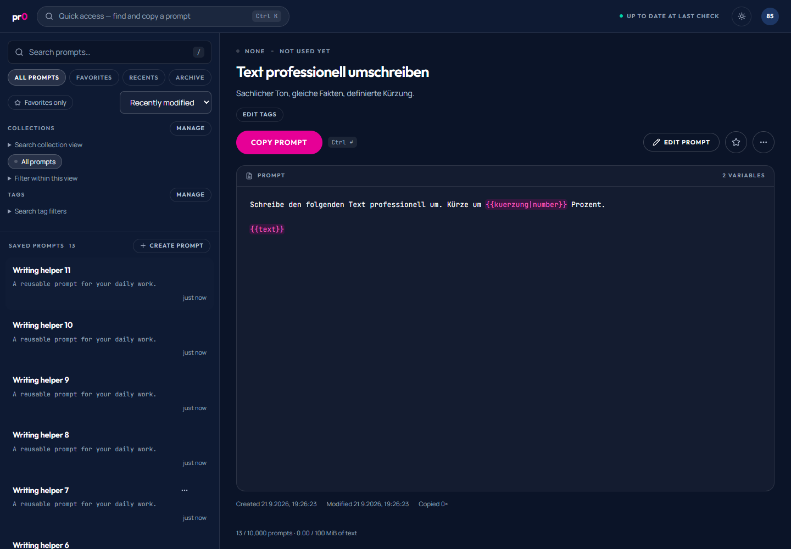
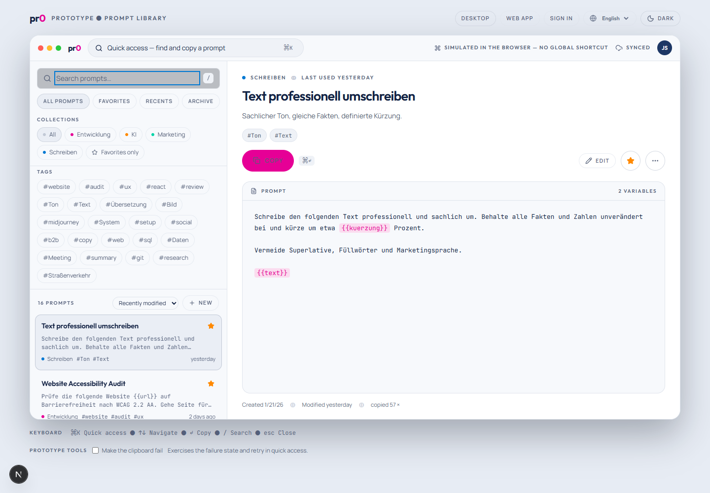
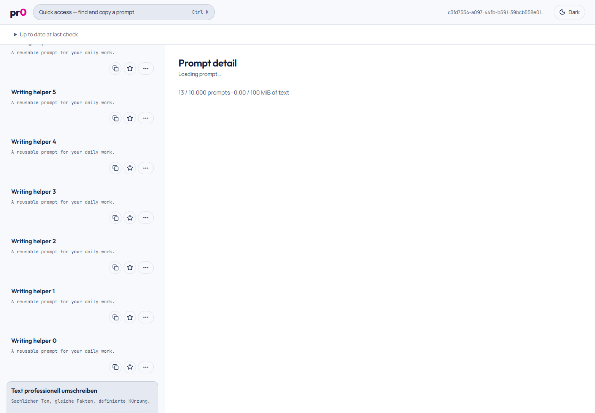
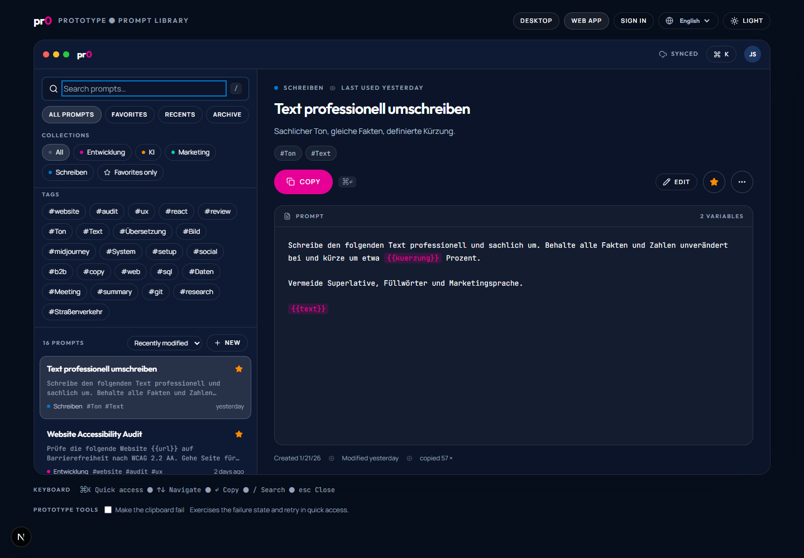
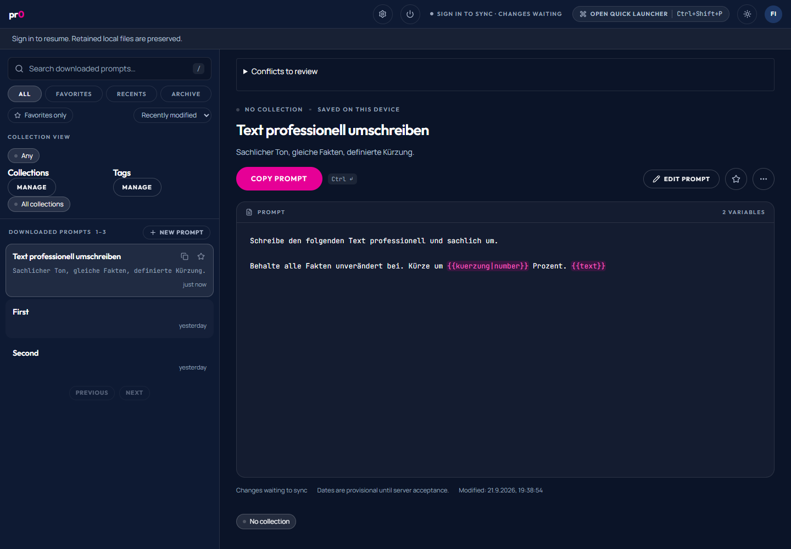
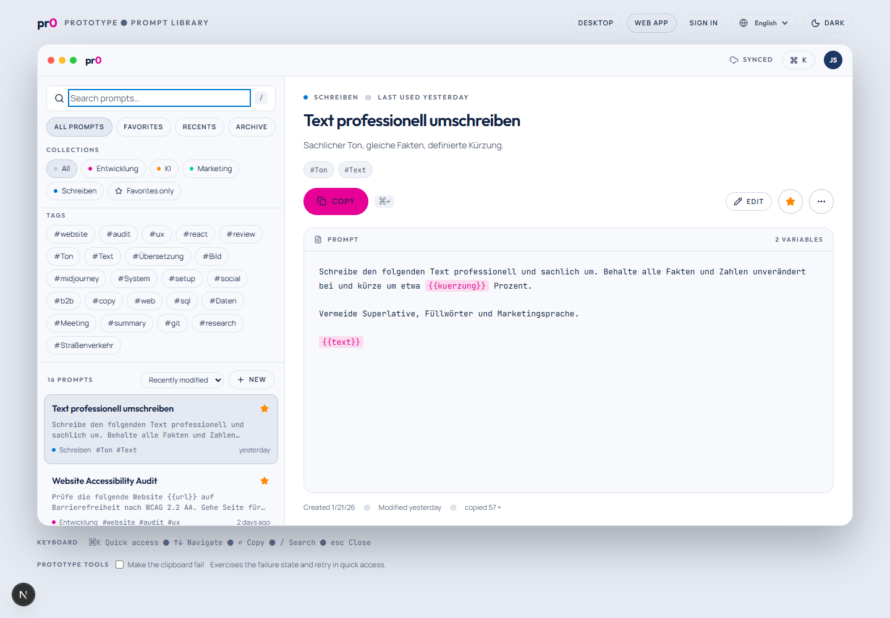
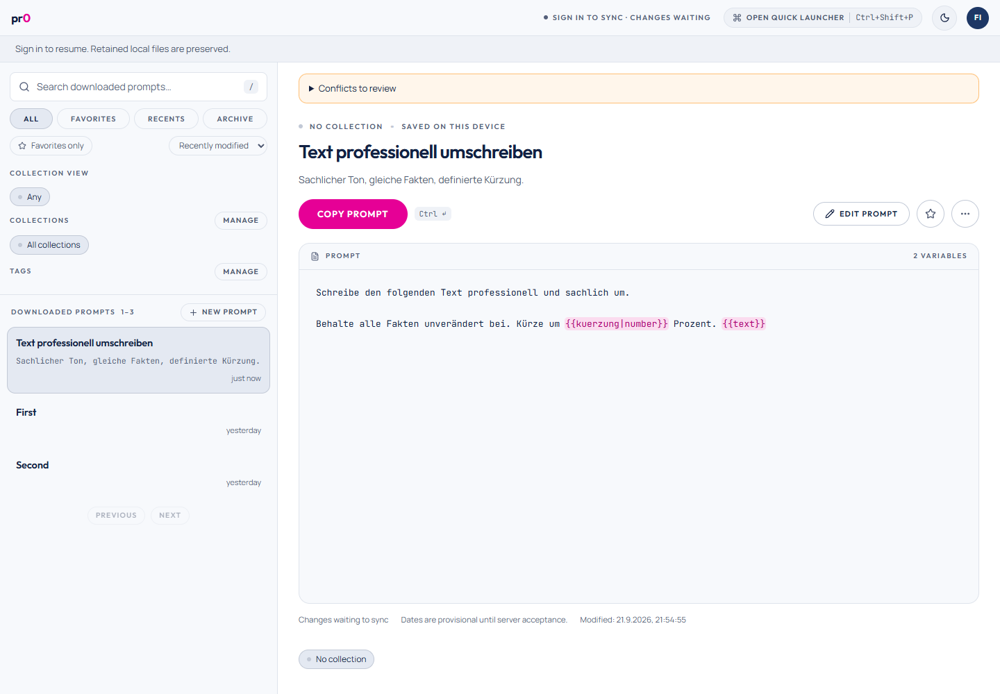

# Accepted design port — issue #75

Status: production design port implemented locally; automated checks and visual evidence recorded below. The user approved the design port on September 21, 2026; the deferred Windows checks remain pending. This is not release sign-off.

## Revision 2 — rebuilt from the Claude Design documents (September 21, 2026)

Issue #75 was reopened after PR #87. That port kept the earlier form-like markup and styled it through structural selectors (`.wf-sidebar section[aria-label=…]`), so colors and fonts matched while the composition did not. Revision 2 rebuilds the presentation from the design sources themselves: the Claude Design project's `pr0 Web-App`, `pr0 Desktop` and `pr0 Anmelden` documents and the Umami Creative design-system tokens they import. Values (surfaces, lines, ink levels, radii, type sizes, tracking, motion) are taken from those documents.

### Surface map for revision 2

| Design document | Production destination | Surface-specific parts |
| --- | --- | --- |
| `pr0 Web-App` | `apps/web/src/app/account-screen.tsx`, `prompt-library.tsx`, `prompt-results.tsx`, `prompt-search-controls.tsx`, `quick-access.tsx`, editor and variable dialogs | 60px app bar with the in-page quick-access pill (`Ctrl K`), real live-change state, theme and account menu. No browser-chrome mock, no native window controls, no claim of a registered global shortcut. |
| `pr0 Desktop` | `apps/desktop/src/app.tsx`, `downloaded-library.tsx`, `search-library.tsx`, `local-prompt-detail.tsx`, editor and variable dialogs | 52px app bar with real sync/offline/attention state, the launcher entry showing the shortcut Windows actually registered (or that none is), theme and the account menu, which holds account/connection, Settings and Quit. The OS title bar stays; decorative traffic lights are not reproduced. |
| Launcher panel in both documents | Native: `apps/desktop/src/launcher.tsx` (dedicated 660×580 window). Browser: `apps/web/src/app/quick-access.tsx` (in-page dialog) | Same compact composition (search row, accent dot, title, collection, `↵`, key-hint footer). The native window adds real shortcut and library state, focus recovery, paging and variable entry in place; the browser overlay adds `Ctrl ↵` Open and stays an in-page dialog. |
| `pr0 Anmelden` | Web sign-in in `account-screen.tsx`; desktop sign-in and browser approval in `apps/desktop/src/app.tsx` | Brand panel beside the form. Only supported methods appear: email/password and configured social providers on the web, server choice plus browser approval of a matching code on desktop. The design's passkey button and sign-up name field are not offered. |

### What moved where

- Shared presentation lives in `packages/ui`: tokens and component utilities in `styles/wayfinder.css`; `wayfinder-shell` (app bar, status and control slots, account menu), `search-box`, `prompt-row`, `prompt-header`, `prompt-content`, `wayfinder-dialog` (head/body/foot), `auth-layout`, chip-style `collection-picker`/`tag-picker`. Pure helpers in `lib/present.ts` (initials, stable collection accent, compact relative time, status tone) are unit-tested.
- Variable highlighting uses `templateSpans` in `@pr0/api-contract/variables`. It shares one scanner with `parseTemplate`, so on the web the highlight cannot disagree with substitution; the desktop substitutes natively and is held to the same canonical fixtures. Typed tokens (`{{n|number}}`) stay whole and escaped tokens stay literal. The stored text remains a selectable read-only field; the highlight is a painted layer beneath it.
- Real state is placed, not hidden: synchronization/attention status sits in the app bar with its full detail in a popover; copy results and retry controls appear as a toast; conflicts, action results and draft recovery stack above the detail; capacity sits in the detail footer.
- Account settings (web) and account/connection (desktop) open from the account menu as a view beside the still-mounted library, so open drafts survive.

### Deliberate differences from the design documents

- The design shows a content preview in each row. List responses carry no content, so rows preview the description; collection, tags and modified time come from the existing summary fields. No API change was made for presentation.
- Row copy and overflow actions appear on hover or keyboard focus (always on touch); the favorite star stays visible when set. All lifecycle actions remain reachable.
- Copy feedback: plain success leaves the screen after about 2.2 seconds as in the design (the timer pauses on hover or focus, and the text stays available to assistive technology). Feedback carrying failure text, pending usage or retry controls persists until acted on.
- Sort, favorites-only, tag filters, management dialogs and paging have no counterpart in the design documents; they use the same chip, pill and eyebrow vocabulary. Picker search fields appear only when a list exceeds eight entries.
- The launcher has no theme control of its own, as in the design; it follows the theme chosen in the main window.
- Light theme is the design's light token set; theme choice persists in `localStorage` and is shared by the desktop main and launcher windows.

### Owner decisions (issue #89, September 21, 2026)

- **Accepted accessibility exception:** variable tokens on dark surfaces use the design's `#E60096` exactly. On the navy background this does not reach WCAG AA text contrast; the owner accepted the shortfall to match the design. The token text is also distinguishable by its braces and background tint.
- The editor stays a full modal: library, status popover and account menu are inert while it is open; **Browse library (keep draft)** and **Resume prompt draft** are the way through. Journeys were adapted to that instead of changing the product.
- Desktop Settings and Quit live in the account menu only. The detail favorite button is named "Favorite prompt" on both surfaces with state in `aria-pressed`.
- Accepted as built: description row preview (a content excerpt follows in #92), row actions on hover/focus, controls without a design counterpart, English sign-in copy.
- Follow-ups: #90 shared editor/variables markup in `packages/ui`, #91 English/German i18n, #93 Claude Design reference exports, #94 prototype removal.

### Revision 2 checks (September 21, 2026, Windows 11, Edge/WebView2)

Run with `PR0_BROWSER_CHANNEL=msedge` and `PR0_TEST_BROWSER=msedge`; this machine has no Chrome, and journeys that hardcoded the `chrome` channel now honor the existing override.

- `bun run check`, `bun run typecheck` (6 workspaces) and `bun run test` pass. New unit coverage: `templateSpans` against every canonical variable fixture, and the presentation helpers in `packages/ui/src/lib/present.test.ts`.
- Web production build (through the journey runner) and the desktop Vite build pass; the desktop bundle emits Outfit, Manrope and JetBrains Mono locally.
- `bun run --cwd apps/web test:design` — web design journey: **1 passed** (REST save/reload, both themes, quick access results/no matches/clipboard failure/variables, keyboard list-to-copy).
- Native WebView2 journeys against a rebuilt, manifested test binary (final run): design-desktop **1 passed**, desktop-resident **5 passed**, desktop-launcher **4 passed**, desktop-variables **2 passed**. Two launcher cases are timing-sensitive on this machine and each failed once in earlier sequential runs, then passed alone and in the final run: release of a contended `Ctrl+Shift+P`, and recents order on the first reopen after a copy.
- Desktop frontend with the real native worker (final run): local-save-ui **8 passed** (one case failed once and passed on re-run), snapshot-ui **1**, compatibility-ui **1**, conflict-review-desktop **1**, organization-native-ui **2**, desktop-search-ui **1**. usage-ui **0 of 1**: it now reaches its last assertion and fails there on a product defect that predates this work, filed as #95 (the library is keyed by sign-in generation since #53, so a generation change drops the open draft). `returning-deletion-native.ts` was adapted but not run (it needs its own Docker stack).

#### Browser journeys: baseline, then adapted (issue #89, Q1)

The same twelve journey files were first measured against `origin/main` at `cf75c01` (PR #87) in a separate worktree: **24 passed, 23 failed** of 47. Nearly all failures had one cause: PR #87 made the editor a modal dialog, as the design specifies, without adapting journeys written for an inline editor.

The owner decided the modal stays and the journeys adapt. Final run on this branch, in three groups of four files against one served production build each: **48 passed, 0 failed** (13 + 14 + 21), including the design journey.

How the journeys changed, without weakening what they assert about persistence, drafts, conflicts, clipboard payloads or retries:

- With a draft open they reach the library through **Browse library (keep draft)** and return with **Resume prompt draft**, re-checking the draft text after resuming. Shared helpers live in `apps/web/tests/app-menus.ts` and `desktop-menus.ts`.
- Controls are reached where they now live: account menu, status popover, "More …" action menus, the "Filter within this view" disclosure.
- Account-switch journeys wait for non-poll requests to finish before switching. Without that, a late response re-sends the previous session cookie and undoes the switch; that is a product risk on `main` too, filed as #96. `networkidle` waits were replaced by a tracker that ignores the live-change long poll.
- Four stale assumptions unrelated to this design were corrected: a clipboard stub for `writeText` while the app writes through `write` (since #38); an "empty library" heading that requires a zero prompt count while archived prompts still count (since #37); a busy-retry check on "the first disabled button"; and a tags assertion that no "Merge into" button appears after a colliding rename, which since #35 appears on purpose after a lookup. That last one now waits for the confirmation and still asserts the name is retained and nothing merged. It is the one place where the meaning of an assertion changed and deserves owner review.

Two product fixes came out of this work, both in this branch: a menu beneath a modal dialog no longer swallows Escape (focus now returns to the delete trigger), and quick access fetches its results only while open. The second halves list requests per refresh; before it, the two-session conflict journey exceeded the 120-calls-per-minute account limit.

Not performed: installer, tray, OS title bar, screen reader and multi-monitor checks; `device`, `changes`, `operations`, `account-deletion` and `backup-restore` runners.

## Reference and destination map (recorded before UI changes)

Reference commit: `ae390cd8d2dd67b3ec6f9eb999a0f8e170cb9a57`, `packages/prototype-library`. The prototype package and `/prototype/library` route were removed in issue #94; its source remains available at that commit. The historical captures are retained unchanged and use English controls and the original German fixture content.

| Surface | Accepted reference | Production destination | Boundary retained |
| --- | --- | --- | --- |
| Browser library | [Web dark](../evidence/design-75/reference-web-dark-detail.png), [web light](../evidence/design-75/reference-web-light-detail.png), matching `editor` and `empty` captures | `apps/web/src/app/account-screen.tsx`, `prompt-library.tsx` and their controls | Authenticated REST client, server acknowledgements, account partition and draft retention |
| Desktop main window | [Desktop dark](../evidence/design-75/reference-desktop-dark-detail.png), [desktop light](../evidence/design-75/reference-desktop-light-detail.png), matching `editor` and `empty` captures | `apps/desktop/src/app.tsx`, `downloaded-library.tsx`, search/detail/editor controls | Native SQLite commands, offline writes, actual download/upload/recovery and account state |
| Dedicated native launcher | [Standalone dark](../evidence/design-75/reference-native-launcher-dark-results.png), [standalone light](../evidence/design-75/reference-native-launcher-light-results.png), matching `empty`, `copy-error`, `variables` captures | `apps/desktop/src/launcher.tsx` | Existing native window/search/copy engine and actual shortcut/focus state |
| Browser quick access | [Web overlay dark](../evidence/design-75/reference-web-overlay-dark-results.png), [web overlay light](../evidence/design-75/reference-web-overlay-light-results.png), matching `empty` captures | Browser-only overlay inside the production library | REST results and browser clipboard; no native capabilities |

Library captures use a 1440×1000 viewport and preserve the prototype mode selector as provenance. Standalone launcher captures use 660×580 and render the exact accepted `LauncherPanel` with `standalone=true` in an ignored local reference harness. They show the accepted panel in a browser renderer, not a native-window validation. The prototype's simulated clipboard error is solely reference evidence.

## Implementation constraints

Shared presentation and locally bundled fonts belong in `packages/ui`. Production must not import the prototype runtime, fixtures or store. The original requirement to keep the prototype route available is superseded by its removal in #94. Preserve complete result navigation rather than its seven-result prototype cap.

Remove decorative traffic lights, fake identity/sync badges and simulated native shortcuts. Retain the real OS title bar on desktop. Show actual account, network, save and recovery states. Browser quick access and the dedicated native launcher are separate surfaces.

Issues #51 and #53 are closed. PR #85 (`c0607fe`) was merged into this branch after refreshing the remote on September 21. Its native template validation and variable-copy flow are retained; the design styles that implementation. The earlier prerequisite assessment used a stale local main revision.

## Production implementation

The web library, native library, browser quick access and dedicated native launcher use shared colors, bundled Outfit/Manrope/JetBrains Mono fonts, theme persistence, compact sidebar controls, icon actions, content panels and modal editors from `packages/ui`. Production imports no prototype runtime or seed store. Native variable behavior comes from merged #53.

Editors retain their mounted draft while **Browse library (keep draft)** or **Open original** exposes saved content; **Resume prompt draft** restores editing. Browser quick access has independent query/filter state, full result pagination, keyboard copy and Ctrl/Cmd+Enter opening. Slash focuses the main search, including when organization searches are collapsed.

Integration uncovered and fixed sign-out rejecting #54's residency files. Cleanup now preserves only the two expected regular metadata files; unknown paths still require review. The native regression confirms signing out retains single-process ownership.

## Deliberate differences from the prototype

- Real account identity, sync/download failures, pending changes and capacity remain visible. There is no fake synced badge, traffic-light decoration, prototype stage selector or simulated global shortcut in production.
- Large organization lists retain search, unavailable selections and management controls. The extra collection filter is expandable; these controls exceed the prototype's seeded chip-only behavior.
- Content remains a selectable read-only text field showing the exact stored template, including typed placeholders. (Revision 2 adds token highlighting as a painted layer beneath that field; see above.)
- Browser and native variable forms retain required-field validation, typed number input, frozen templates, changed-template recovery, bounded output and failure retention. Their explanatory text and larger multiline fields take more room than the prototype.
- Native launcher's window, shortcut and focus policy remain owned by #51/#53. The browser overlay additionally implements the prototype's open-in-library shortcut; no new native command was invented to imitate it.
- Production save failures have no equivalent prototype storage/server failure. The error captures below show actual REST quota refusal and an actual SQLite disk-full fault in the test host, not a shipped simulated-error control.

## Side-by-side detail views

| Surface/theme | Accepted prototype | Production |
| --- | --- | --- |
| web / dark |  |  |
| web / light |  |  |
| desktop / dark |  |  |
| desktop / light |  |  |

## State comparison matrix

Each cell links reference → production at the same viewport and theme. Main libraries use 1440×1000; the native launcher uses 660×580. Native captures are WebView client areas, not evidence of OS chrome, tray behavior or manual foreground switching. Fixture content differs because production uses real isolated REST/SQLite records.

| Surface / state | Dark | Light |
| --- | --- | --- |
| web / editor | [Reference](../evidence/design-75/reference-web-dark-editor.png) → [Production](../evidence/design-75/production-web-dark-editor.png) | [Reference](../evidence/design-75/reference-web-light-editor.png) → [Production](../evidence/design-75/production-web-light-editor.png) |
| web / empty | [Reference](../evidence/design-75/reference-web-dark-empty.png) → [Production](../evidence/design-75/production-web-dark-empty.png) | [Reference](../evidence/design-75/reference-web-light-empty.png) → [Production](../evidence/design-75/production-web-light-empty.png) |
| desktop / editor | [Reference](../evidence/design-75/reference-desktop-dark-editor.png) → [Production](../evidence/design-75/production-desktop-dark-editor.png) | [Reference](../evidence/design-75/reference-desktop-light-editor.png) → [Production](../evidence/design-75/production-desktop-light-editor.png) |
| desktop / empty | [Reference](../evidence/design-75/reference-desktop-dark-empty.png) → [Production](../evidence/design-75/production-desktop-dark-empty.png) | [Reference](../evidence/design-75/reference-desktop-light-empty.png) → [Production](../evidence/design-75/production-desktop-light-empty.png) |
| web-overlay / results | [Reference](../evidence/design-75/reference-web-overlay-dark-results.png) → [Production](../evidence/design-75/production-web-overlay-dark-results.png) | [Reference](../evidence/design-75/reference-web-overlay-light-results.png) → [Production](../evidence/design-75/production-web-overlay-light-results.png) |
| web-overlay / empty | [Reference](../evidence/design-75/reference-web-overlay-dark-empty.png) → [Production](../evidence/design-75/production-web-overlay-dark-empty.png) | [Reference](../evidence/design-75/reference-web-overlay-light-empty.png) → [Production](../evidence/design-75/production-web-overlay-light-empty.png) |
| web-overlay / copy-error | [Reference](../evidence/design-75/reference-web-overlay-dark-copy-error.png) → [Production](../evidence/design-75/production-web-overlay-dark-copy-error.png) | [Reference](../evidence/design-75/reference-web-overlay-light-copy-error.png) → [Production](../evidence/design-75/production-web-overlay-light-copy-error.png) |
| web-overlay / variables | [Reference](../evidence/design-75/reference-web-overlay-dark-variables.png) → [Production](../evidence/design-75/production-web-overlay-dark-variables.png) | [Reference](../evidence/design-75/reference-web-overlay-light-variables.png) → [Production](../evidence/design-75/production-web-overlay-light-variables.png) |
| native-launcher / results | [Reference](../evidence/design-75/reference-native-launcher-dark-results.png) → [Production](../evidence/design-75/production-native-launcher-dark-results.png) | [Reference](../evidence/design-75/reference-native-launcher-light-results.png) → [Production](../evidence/design-75/production-native-launcher-light-results.png) |
| native-launcher / empty | [Reference](../evidence/design-75/reference-native-launcher-dark-empty.png) → [Production](../evidence/design-75/production-native-launcher-dark-empty.png) | [Reference](../evidence/design-75/reference-native-launcher-light-empty.png) → [Production](../evidence/design-75/production-native-launcher-light-empty.png) |
| native-launcher / copy-error | [Reference](../evidence/design-75/reference-native-launcher-dark-copy-error.png) → [Production](../evidence/design-75/production-native-launcher-dark-copy-error.png) | [Reference](../evidence/design-75/reference-native-launcher-light-copy-error.png) → [Production](../evidence/design-75/production-native-launcher-light-copy-error.png) |
| native-launcher / variables | [Reference](../evidence/design-75/reference-native-launcher-dark-variables.png) → [Production](../evidence/design-75/production-native-launcher-dark-variables.png) | [Reference](../evidence/design-75/reference-native-launcher-light-variables.png) → [Production](../evidence/design-75/production-native-launcher-light-variables.png) |

Production-only save errors: [web dark](../evidence/design-75/production-web-dark-error.png), [web light](../evidence/design-75/production-web-light-error.png), [desktop dark](../evidence/design-75/production-desktop-dark-error.png), [desktop light](../evidence/design-75/production-desktop-light-error.png).

## Automated checks (September 21, 2026)

- `bun run typecheck` and `bun x --bun ultracite fix`: pass.
- Web production build and desktop Vite build: pass; all three font families are bundled for offline use. Web build retains the existing dynamic search-directory tracing warning.
- `bun run test`: all eight workspace tasks pass (five valid cache hits after the merge).
- Native Rust suite: **153 passed**, including sign-out with resident ownership, variable conformance, clipboard behavior and offline storage/restart.
- Browser design/search/variables: **14 passed**, covering REST save/reload, both themes, quick-access failures and variables, keyboard navigation, full results, account changes and a 390px viewport.
- Browser retained/conflict drafts: **2 passed**, including Open original, browsing saved content while retaining successor text, and retry/copy after quota refusal.
- Native launcher: **4 passed**, including one/four competing shortcuts, manual recovery, offline copy and residency close behavior.
- Native variables: both tests passed in focused runs, including clipboard failure, back/query preservation, sign-out clearing, maximum output and 1,000 fields. Timing from #53 is not re-certified as a release percentile.
- Native design journey: **1 passed**, covering modal draft retention, offline save/restart, persisted theme, dedicated launcher, empty results, variable fields and SQLite disk-full retention. Run foreground-sensitive native journeys alone; launching other shell processes can cause the launcher to hide under its normal blur policy.
- Resident lifecycle: **4 passed** through the modal browse/resume path, including save-before-quit, cancellation, failed save and repeated activation.
- Independent Standards review: no hard violations. Spec follow-up review: no remaining concrete findings in the addressed editor, keyboard and merge changes.

The WebView test executable needs `apps/web/tests/webview.manifest` embedded with the Windows SDK manifest tool after rebuilding. Browser runs use `PR0_BROWSER_CHANNEL=msedge` on this machine. The integration server and credentials are isolated test fixtures.

## Approval and remaining Windows validation

The user approved the presented design port and comparison evidence on September 21, 2026. This records design acceptance, not a claim that every manual Windows check was performed. Verify Windows OS titlebar, tray, native shortcut/focus behavior and the remaining #54 matrix in a normal desktop session. Those checks were explicitly deferred until after the port. No issue closure or installer validation is claimed here.
