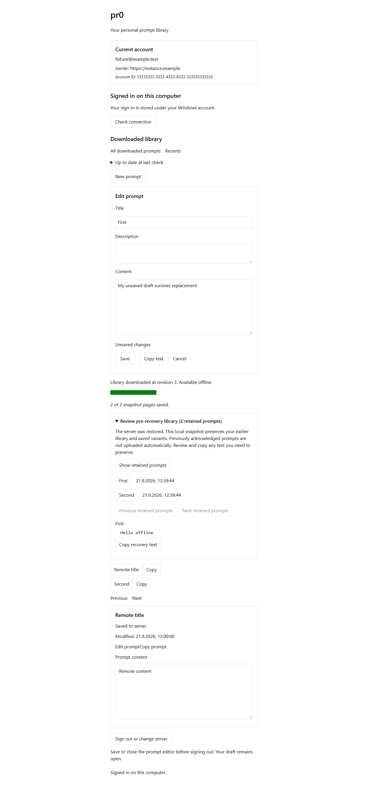

# Desktop recovery — issue #47

Validated on Windows on 2026-09-21 with Bun 1.4.2, PostgreSQL 17, Edge, and Rust/Tauri.

## Behavior

- `snapshot_required` stages bounded, digest-checked pages while the previous library remains readable. Intervening changes apply to staging before a single SQLite transaction activates the replacement and checkpoint. Initial downloads retain their existing behavior.
- SQLite migration 6 retains pending identities, frozen upload envelopes, receipts, saved overlays and usage. Pausing, retrying, expired manifests, corrupt pages and failed writes do not replace the active baseline. The Windows scratch-space check is advisory; transactional writes also protect against space disappearing after preflight.
- An epoch change archives the previous baseline and visible saved variants, including pending work. Old receipts cannot certify durability in the restored epoch. Existing work and edits made against the archived baseline require review; recovery does not create uploads for formerly acknowledged library rows. Retained prompts are browsable and their text can be copied into a new prompt.
- Page counts, catch-up, pause, error, historical freshness and pending work remain distinct. Download completion does not imply every pending operation is synchronized. Selection and an open unsaved draft survive activation.
- Public REST is unchanged. Shared validators, native command registration and permissions cover the new recovery status, pause and archive commands. Account/generation guards remain in place, and retained recovery text prevents implicit account cleanup.

## Executed validation

| Command / journey | Result |
| --- | --- |
| `bun run typecheck` | All six workspace tasks passed. |
| `bun run test` | All workspace test tasks passed. |
| `bun x --bun ultracite fix` / `bun x --bun ultracite check` | Formatting and lint passed. |
| `cargo fmt --manifest-path apps/desktop/src-tauri/Cargo.toml --check` | Passed. |
| `cargo test --manifest-path apps/desktop/src-tauri/Cargo.toml --lib recovery_ --locked` | Seven recovery tests passed, including actual subprocess termination before page commit and before/after activation. |
| `cargo test --manifest-path apps/desktop/src-tauri/Cargo.toml --lib --locked` | 72 passed; the existing OS clipboard test failed with `clipboard_unavailable`. A serial run had the same result. |
| `bun test apps/web/tests/local-save-ui.test.ts` | Six Edge/native-SQLite journeys passed, 26 assertions, using `PR0_TEST_BROWSER=msedge` and `PR0_TEST_DESKTOP_ORIGIN=http://127.0.0.1:1427`. |
| `bun run --cwd apps/web test:desktop-recovery` | Disposable production server, public snapshot contract checks, native HTTPS and database restore journey passed. |
| `bun run --cwd apps/desktop build` | Production frontend build passed with the CI placeholder API origin. |
| `git diff --check` | Passed. |

The native tests cover staged catch-up, preserved last-check time, stale high-revision receipts across epoch changes, pause/resume, expiry, digest corruption, injected scratch-space failure, saved variants and edits during staging. Process-kill tests reopen real SQLite files and require the old or new complete baseline, never a partially activated library.

The public runner performs two snapshot REST tests (139 assertions) and expires a manifest by advancing its persisted age beyond fifteen minutes. Its independent native HTTPS client uses Windows Credential Manager and real SQLite. It retains an offline edit across history aged 91 days, observes an intervening browser mutation during staging, uploads through the existing conflict protocol, and then recovers after the acknowledged conflict copy, its receipt and notice are removed before an epoch change. The final result retained three prompts and one accepted-awaiting-download variant with the original pending identity. Database age/restore manipulation belongs to the disposable fixture; production code has no corresponding test switch.

The broader UI run caught a fixture regression: newly exposing download commands consumed the offline-only workers' nonexistent snapshot responses. Restricting downloads to the recovery fixture restored all six journeys. The recovery UI screenshot was visually inspected and is retained below.

## Review

| Axis | Result |
| --- | --- |
| Standards | No standards violation; duplicated recovery detection was consolidated. |
| Specification | Corrected freshness preservation, misleading pre-restore receipt wording, edits during epoch staging and unchanged-save recovery status. The reviewer confirmed the findings resolved with no remaining blocker. |

The remaining native test limitation is Windows OS clipboard availability in this session. Clipboard production code was not changed. Browser clipboard callbacks use the existing test boundary, so those UI results do not certify real clipboard access. These checks also do not constitute a release-signed installer, built WebView2 shell or Windows reboot test.

