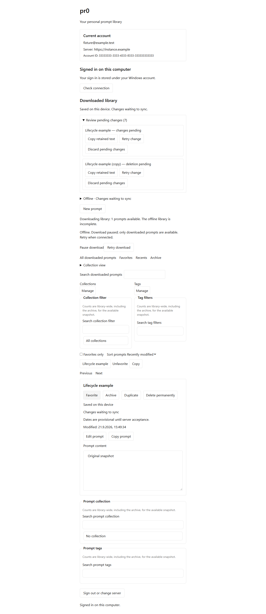

# Offline prompt lifecycle — issue #44

Implemented on Windows with Bun 1.4.2 and Rust/Tauri. Native SQLite commands persist favorite, archive/restore, duplicate and confirmed permanent deletion, then deliver the established public REST operations.

## Behavior

- Projection, local revision, search changes, deletion visibility and outbox commit together. Backed-up SQLite migration 9 integrates lifecycle storage with organization and search, upgrades the original lifecycle version-6 layout and main's version-8 layout, preserves pending work, and prevents reuse of locally created identities.
- Active, Favorites, Archive and Recents respect archive eligibility. Archived records remain editable/copyable; duplication takes the selected snapshot, retains organization and full source title, and resets favorite/archive/usage with fresh dates.
- Metadata actions remain separate from text intent. Incoming changes retain pending metadata. Conflict acknowledgements retarget the complete successor chain while preserving later text and lifecycle actions.
- A stale delete's server conflict copy is downloaded from authoritative state; it is never fabricated from stale local text. Accepted deletion remains hidden until its canonical revision arrives. Old accepted receipts cannot restore later server deletions.
- Local errors retain the chosen action and source text with Retry and Copy. Pending changes have Retry, Copy retained text and confirmed Discard. Unknown delivery and accepted effects awaiting download prevent discard from claiming a false outcome. Retrying preserves the frozen UUID and envelope.
- Public REST/OpenAPI operation shapes are unchanged. Shared native request validators, Tauri command registration and local-only permissions are updated together. The duplicate title fixtures are shared by native and REST tests.

## Executed evidence

| Check | Result |
| --- | --- |
| Bun workspace tests | All 8 tasks passed (including unchanged cached suites). |
| Workspace typecheck | All 6 tasks passed. |
| Ultracite fix | Passed after extracting status rendering and fixing reported lint issues. |
| Full native suite | Final integration run: all 137 passed, including real Windows clipboard, Credential Manager process restarts, and migration backup/rollback/interruption checks through predecessor version 8. |
| Lifecycle native regression tests | All 18 lifecycle-filtered tests passed, including legacy migration, create/copy/edit dependencies, dependent discard, more than 100 pending deletions, replacement metadata retention, and restore quarantine. |
| REST lifecycle/deletion integration | 18 passed, 116 assertions against isolated PostgreSQL and the production Bun/Next.js server. |
| Native HTTPS lifecycle journey | Passed again after review: browser device approval, Windows Credential Manager, SQLite process restarts, reconnect, offline create/copy/source-edit dependencies, both text/delete arrival orders, metadata refusal/discard, lost conflict receipt with successor editing, later deletion/replay, and usage retention. |
| Desktop browser/native journeys | All 9 passed in headless Edge, including uncertain local commit retry, cancellation, partial offline download, copy selection across metadata actions, and navigation interrupted by search admission. |
| Production builds | Bun/Next.js web and Vite desktop production builds passed after integration. Rust formatting passed. The earlier implementation also built a Tauri debug executable; no installer or signed release was generated. |

The red/green native tests exposed and then verified corrections for missing lifecycle commands, loss of metadata during text coalescing and live updates, lost successor chains, retained duplicate titles and local I/O rollback. The REST suite also verifies quota refusals and atomic storage-failure rollback before preservation/deletion can commit.

The HTTPS lifecycle journey controls the external clipboard write boundary explicitly. The separate native OS clipboard test passed in the final full run; earlier attempts encountered `clipboard_unavailable`. A sandboxed full run also encountered `credential_unavailable`; the final run with Credential Manager access passed all tests. The production clipboard implementation is unchanged. No release-signed installation, Windows reboot or power-loss claim is made.

## Review corrections

The independent Standards and Spec reviews found a source-create dependency being removed by coalescing, discard orphaning dependent copies, and an uncertain local commit incorrectly labelled unsaved. Regression tests reproduced these problems before correction. Referenced operation identities now remain stable, discard refuses pending dependent copies, and uncertain UI actions retain their identity until Retry confirms the result. Recovery includes the full 10,000-prompt capacity with 50-row UI pages.

## Standards

No actionable remaining findings in the corrections relative to `2b15620`. Both dependency defects are addressed; the reviewer found no regressions in recovery pagination, uncertainty handling, or UI changes.

## Spec

No remaining actionable spec findings in the corrections relative to `2b15620`. Referenced create operations are preserved, dependencies of pending copies cannot be discarded, uncertain commits are reported honestly, and recovery is accessible beyond 100 prompts.

## Integration with current main

Reconciled against `4a02108`. Four new native regressions reproduced and verified fixes for replacement downloads losing favorite/archive intent, metadata-only overlays reverting newer server text, lifecycle actions escaping restore quarantine, and Retry releasing quarantined work. Two browser regressions reproduced and verified that a duplicated prompt remains the action target after favoriting and that a retried navigation can replace its detail. Deleting the copy explicitly verifies the archived source survives.

The strict partial-download fixture now supplies the current search, organization and recovery contracts. Capacity-read fixtures honor the server's bounded retryable admission response. The HTTPS lifecycle race uses the same fixture-only authentication burst allowance as organization races; production limits are unchanged. REST capacity tests passed 18/18 with 116 assertions, and the native HTTPS runner reported `LIFECYCLE_NATIVE_OK` followed by successful independent sign-out. Final integration evidence was recorded on 2026-09-21.

Final review after corrections: Standards 0 remaining actionable findings; Spec 0 remaining actionable findings.
